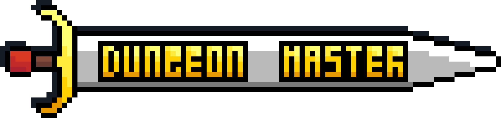

# Dungeon Master

Dungeon Master - Game Boy Advance(GBA) rogue like game written specially for [GBA Jam 2022](https://itch.io/jam/gbajam22) (P.S actually we missed due to some university work 🙃)
 

## Setup

**devkitadv** - Software Development Kit for the Nintendo(tm) Gameboy Advance(tm) based on GCC.

**[Note] devkitadv already contains gcc, if you already have one, try to temporary remove mingw's gcc from PATH environment variable.**

Follow these few steps to install development environment on your local machine:
- Dowloand full packed **devkitadv** package. [link](https://drive.google.com/file/d/1e5EfY6YxEkvzd7Fgp4rJgkPiA7NVlmBN/view?usp=sharing)
- Unzip archive in preferred place.
- *[Optional] add %YourChosenPath%/devkitadv/bin to PATH environment variables*
- *[Optional] test your setup by building test project*
- Setup is finished 😊
